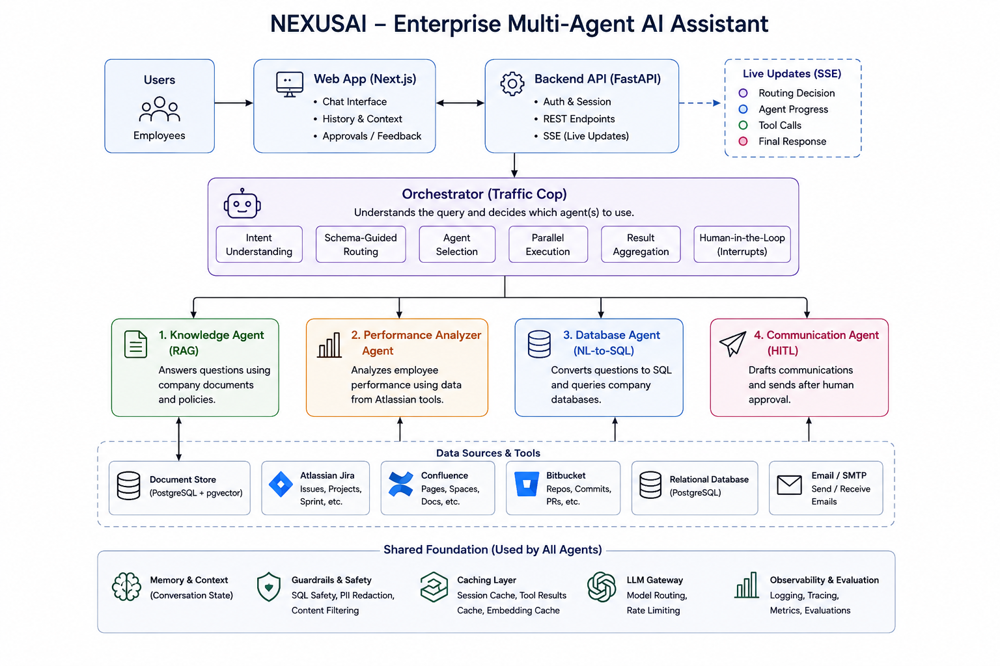

# Nexus AI — AI Internal Company Assistant

An orchestrator that routes employee requests to specialized sub-agents — knowledge/RAG,
performance/Atlassian, database/SQL, and communication — and fans the results back into one
response. Built to demonstrate real multi-agent orchestration patterns (hybrid routing, parallel
fan-out, tool-calling loops, human-in-the-loop confirmation, live tracing) using hand-rolled
`asyncio`.

Live: backend on [Render](https://nexusai-api-ctud.onrender.com) (`GET /health`), frontend on
[Vercel](https://nexus-ai-sand-nine.vercel.app).

## Overview

Instead of one large model trying to do everything, requests are routed to whichever
specialized agent(s) actually own the answer:

- **Knowledge Agent** — answers questions from static company-policy documents (PTO, expenses,
  onboarding, runbooks) via retrieval-augmented generation.
- **Performance Agent** — answers questions about sprint velocity, ticket activity, and commit
  history against a real Jira/Confluence/Bitbucket sandbox.
- **Database Agent** — answers questions about structured company data (employees, deals,
  expenses, support tickets) by writing and running real, read-only SQL.
- **Communication Agent** — sends a Slack message or email on the user's behalf, but only after
  a human explicitly confirms a staged draft.

A hybrid router (an LLM reasoning about intent, constrained to a validated schema of real agent
names) decides which agent(s) handle a given request — a single request can fan out to more than
one agent at once, running concurrently. Every step of that process — routing, agent start/finish,
tool calls — streams live to the frontend over Server-Sent Events.

## Features

- **Hybrid, schema-guarded routing** — an LLM reasons about intent, but its decision is forced
  through a strict schema before anything acts on it; invalid output is retried, never trusted.
- **Concurrent multi-agent fan-out** — a single request can route to several agents at once, all
  running in parallel via `asyncio.gather`.
- **Real tool-calling agents** — Performance, Database, and Communication agents run genuine
  multi-turn tool-calling loops, not single-shot prompts, gathering data across several lookups
  before answering.
- **Layered guardrails per agent** — a groundedness flag for RAG answers, a stacked
  judgment-call → regex-filter → read-only-database-role guardrail for SQL, and a
  destination-never-LLM-controlled rule for messaging.
- **Human-in-the-loop confirmation** — the Communication Agent only ever stages a draft; nothing
  sends until an explicit Send / Edit / Cancel decision.
- **Session-scoped conversation memory** — the last few turns of a conversation are threaded into
  whichever agent(s) handle a follow-up, even if routing switches agents mid-conversation.
- **Session-scoped tool-result caching + parallel tool calls** — independent tool calls within one
  turn run concurrently, and repeated lookups within the same conversation are memoized instead of
  re-fetched.
- **Live orchestration trace** — routing decisions, agent start/finish, and every tool call stream
  to the frontend in real time as they happen, not just after the whole request finishes.
- **A real web app** — login, streaming chat, a live trace panel, and a 3-choice confirmation card
  for staged Slack/email drafts, backed by a FastAPI API and a Next.js frontend.
- **An evaluation harness** — DeepEval-based RAG metrics (contextual precision/recall,
  faithfulness, answer relevancy) for the Knowledge Agent, and LLM-judge correctness checks for
  Performance and Database agents, built as a regression suite from real bugs found during
  development.

## Tech Stack

**Backend**
- Python 3.11+, `asyncio`
- FastAPI (web API, Server-Sent Events streaming)
- OpenAI API (`gpt-4.1-mini` for reasoning/generation, `text-embedding-3-small` for embeddings)
- Pydantic (schema-guarded structured outputs)
- PostgreSQL + `pgvector` (vector store and structured company data)
- Atlassian Remote MCP Server (Jira/Confluence), via the official `mcp` SDK
- `httpx` (Bitbucket REST, Slack API, Resend email API)
- DeepEval (RAG and agent-correctness evaluation)

**Frontend**
- Next.js, React, TypeScript
- Server-Sent Events client for the live trace panel

**Infrastructure**
- Docker Compose (local Postgres + pgvector)
- Render (backend hosting), Vercel (frontend hosting) — both dashboard-configured, no IaC

## Architecture



A request comes in from the frontend, passes through the API to the Orchestrator, which decides
via the Router which agent(s) should handle it and runs them in parallel. Each agent reaches into
its own data sources (Jira/Confluence via MCP, Bitbucket via REST, Postgres, Slack/Resend), and
every step — routing, agent progress, tool calls, the final response — streams back to the
frontend live over Server-Sent Events.

Every agent implements the same `Agent` protocol (`async def handle(...)`), so the orchestrator
never needs to know about concrete agent implementations — only the interface. Domain logic never
imports a vendor SDK directly: an `LLMClient` protocol sits in front of OpenAI, an
`EmbeddingClient` protocol in front of the embedding API, and a `VectorStore` protocol in front of
pgvector, each with exactly one real adapter. This is what makes every agent testable with fakes
instead of live API calls.

The Communication Agent is the only agent with a real side effect, so it gets two extra
guardrails the read-only agents don't need: the LLM never controls the send destination, and nothing sends immediately — `handle()` only ever stages a pending draft, and a separate,
explicit confirmation step actually executes it.

## Project Structure

```
enterprise-ai/
├── src/enterprise_ai/
│   ├── orchestrator/         # Router, Orchestrator, ConversationMemory, schemas
│   ├── agents/
│   │   ├── knowledge/        # RAG agent
│   │   ├── performance/      # Jira/Confluence/Bitbucket tool-calling agent
│   │   ├── database/         # SQL tool-calling agent
│   │   └── communication/    # Slack/email agent with HITL confirmation
│   ├── core/                 # Agent/LLMClient/EmbeddingClient protocols, ToolCache, retry logic
│   ├── integrations/         # Concrete adapters: pgvector, Atlassian REST, Postgres, Slack/Resend
│   └── bootstrap.py          # Shared resource + per-session wiring, reused by every entry point
├── api/                       # FastAPI backend (auth, chat/SSE, pending actions, sessions)
├── web/                        # Next.js frontend
├── evaluation/                 # DeepEval-based RAG and agent-correctness evaluation harness
├── scripts/                    # CLI chat client, live smoke tests, data-seeding scripts
├── tests/unit/                 # Fake-backed unit tests (no network calls, no API key required)
├── docker-compose.yml          # Local Postgres + pgvector
├── pyproject.toml              # Python dependencies (source of truth)
└── .env.example                # All required environment variables, documented
```

## Getting Started

**Requirements:** Python ≥ 3.11, Node.js (for the frontend), Docker (for local Postgres).

```bash
# 1. Set up the Python environment
py -m venv .venv
.venv/Scripts/python.exe -m pip install -e ".[dev]"

# 2. Start Postgres + pgvector (required for the Knowledge and Database agents)
docker compose up -d postgres

# 3. Configure environment variables
cp .env.example .env
# fill in OPENAI_API_KEY at minimum; see .env.example for what each component needs
```

The Performance Agent additionally needs a real Atlassian Cloud site (Jira + Confluence) and a
Bitbucket workspace — account setup is manual (see `.env.example`'s Atlassian section), after
which the seeding scripts under `scripts/` populate it with synthetic data. The Communication
Agent needs a Slack bot token and a Resend API key (see `.env.example`'s Communication Agent
section).

## Usage

**CLI chat client** (fastest way to try every agent from one terminal):

```bash
.venv/Scripts/python.exe scripts/chat.py
```

**Full web app** (needs the same `.env` as above, plus `APP_USERS_JSON` — generate a password
hash with `scripts/hash_password.py`):

```bash
.venv/Scripts/python.exe -m uvicorn api.main:app --reload --port 8000
cd web && npm install && npm run dev   # in a separate terminal — serves http://localhost:3000
```

Example questions to try, one per agent:

- *"What's our PTO policy in the US?"* → Knowledge Agent
- *"How many tickets did Priya Nair complete in sprint 6?"* → Performance Agent
- *"What's the average expense claim amount this quarter?"* → Database Agent
- *"Post a Slack message letting the team know the demo went well."* → Communication Agent,
  stages a draft and waits for you to confirm, edit, or cancel it

A single request can also span more than one agent at once — e.g. *"Compare last sprint's
velocity to what the docs promised"* routes to both Performance and Knowledge concurrently.

## Future Improvements

- **Automated CI/CD** — currently each platform auto-deploys on push to `main`, with no automated
  test gate (unit tests or a live smoke test) required to pass first.
- **Caching for the Knowledge Agent and repeated database questions** — tool-result caching for
  the Performance/Database agents is already in place; embedding-query caching and a
  question-to-SQL cache (for literal repeat questions) are still open.
- **Bitbucket over MCP** — Jira and Confluence now go through Atlassian's Remote MCP Server;
  Bitbucket Cloud support exists there too, but requires linking the Bitbucket workspace to the
  Atlassian organization first (a one-time dashboard step not yet done), so it still uses direct
  REST for now.
- **Agentic tracing metrics** — the evaluation harness currently checks answer correctness;
  tool-use-correctness and task-completion metrics (which need additional instrumentation) aren't
  wired up yet.
- Persistent conversation memory
